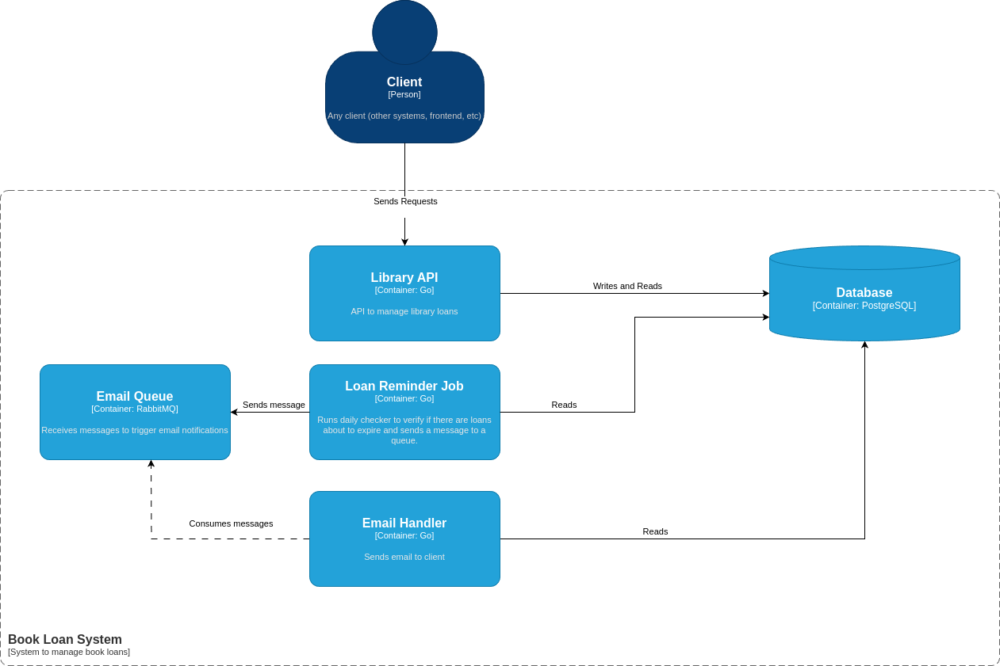

# Book Loan System

Backend System to manage book loans.

## Functionalities

- Create user
- Get user
- Get users
- Get List of Books (with filters)
- Get Book details
- Get Book item details
- Lend a book (item)
- Return a book (item)
- Send email to client when loan is about to expire

Database Diagram

System Design

## Technologies

- Go
- Docker
- RabbitMQ

## TODO

- [X] Build API
- [X] Build loan expiring job
- [X] Build email handler
- [X] Add database migrations
- [X] Dockerfiles
- [X] Docker Compose
- [ ] Swagger Docs
- [ ] Integrate with Prometheus for metrics?
- [ ] Rename book_items to book_copies (db, code, db diagram and NOTES.md)
---

## How to run

- Create a `.env` filed based on the `.env.example`

- build the infraestructure and execute the project by running

`docker compose --env-file .env build --no-cache && docker compose --env-file .env up -d --force-recreate`

