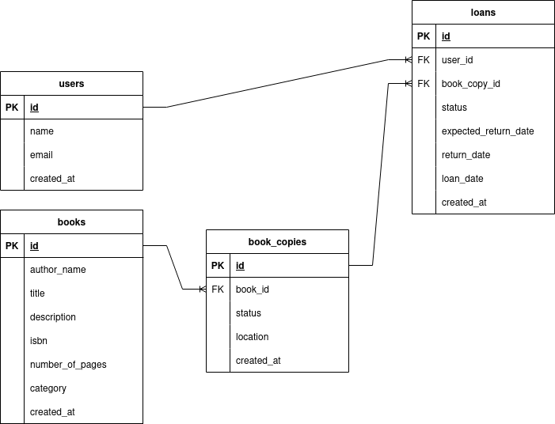

# Book Loan System

Backend System to manage book loans.

## Functionalities

- Create user
- Get user
- Get users
- Get List of Books (with filters)
- Get Book details
- Get Book item details
- Lend a book (item)
- Return a book (item)
- Send email to client when loan is about to expire

Database Diagram

System Design

## Technologies

- Go
- Docker
- RabbitMQ

## TODO

- Build API
- Build loan expiring job
- Build email handler

---

## How to run

`make api-run`